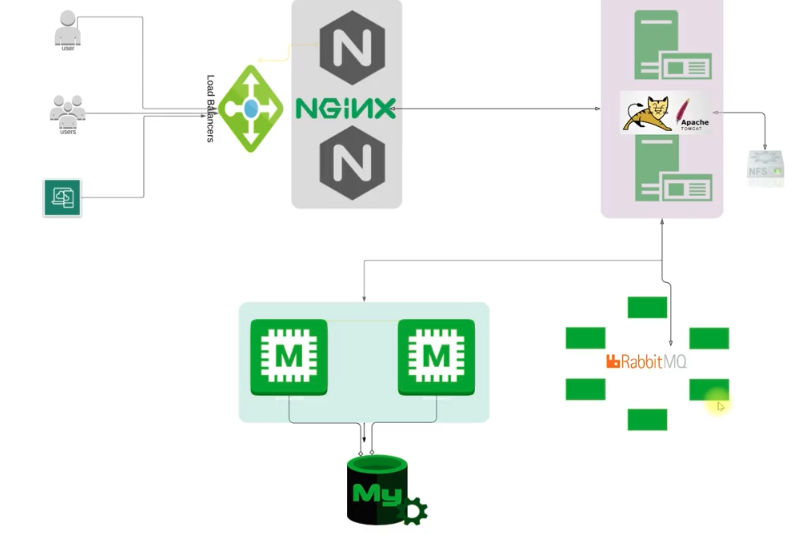

# vProfile Multi-Tier Setup

Welcome to the **vProfile Multi-Tier Setup**! This project will guide you through setting up a complete multi-tier web application stack on your own machine.

---

## 🚦 Flow of Execution

Here's the big picture of what you'll do in this project:

1. **Set up the prerequisite tools**  
   (Vagrant, VirtualBox, Git Bash, etc.)
2. **Clone the source code**  
   Get this project onto your computer.
3. **Navigate to the Vagrant directory**  
   Choose the right folder for your OS.
4. **Bring up the VMs**  
   One command, and your virtual machines are ready!
5. **Validate**  
   Make sure everything is running and the VMs can talk to each other.
6. **Set up all the services**  
   Install and configure MySQL/MariaDB, Memcached, RabbitMQ, Tomcat, NGINX, and deploy the app.
7. **Verify from your browser**  
   See your hard work in action!

---

## 🌟 About the Project

This project is all about making complex setups simple and repeatable. You'll learn how to automate the creation of a real-world, multi-tier web application environment—right on your laptop or desktop. This will be your foundation for all the projects to come!

---

## 🎯 Objectives

- **Automate VM setup locally** so you can focus on learning, not troubleshooting.
- **Create a baseline** for future projects—no more starting from scratch.
- **Simulate real-world environments** for safe R&D and experimentation.

---

## 🏗️ Architecture

Here's what you'll be building:

- **Users** connect to your app through a load balancer.
- **NGINX** acts as a reverse proxy, forwarding requests to your app server.
- **Apache Tomcat** runs your Java/Spring web application.
- **NFS** provides shared storage.
- **Memcached** speeds things up with caching.
- **MySQL** stores your data.
- **RabbitMQ** handles messaging between services.



---

## ⚡ Automated Service Setup

No more manual installs! Bash scripts are provided to set up all the core services:

- NGINX
- Apache Tomcat
- NFS
- Memcached
- MySQL
- RabbitMQ

**How to use:**
```bash
cd vagrant/Automated_provisioning
bash nginx.sh
bash tomcat.sh
bash nfs.sh
bash memcache.sh
bash mysql.sh
bash rabbitmq.sh
```
> Pick the right directory/scripts for your OS and architecture.

---

## 🤖 Manual vs Automated Provisioning

You can set up your environment in two ways:

### Manual Provisioning
- **You do it all yourself:** Log into each VM, install and configure everything step by step.
- **Great for learning,** but can be slow and error-prone.

### Automated Provisioning
- **Let the scripts do the work:** With one `vagrant up`, all VMs are created and provisioned automatically.
- **Fast, consistent, and repeatable.** Perfect for teams and rebuilding environments.

---

## 🛠️ Tools Used

- **Oracle VM VirtualBox** (hypervisor)
- **Vagrant** (automation)
- **Git Bash** (CLI)
- **Sublime Text** (IDE)
- **Ansible** (for advanced automation, in `ansible/`)

---

## 💻 Technologies

- Spring MVC, Spring Security, Spring Data JPA
- Maven, JSP, MySQL
- Memcached, RabbitMQ, Elasticsearch

---

## 🚀 Getting Started

### Prerequisites

- JDK 1.8 or later
- Maven 3 or later
- MySQL 5.6 or later
- Oracle VM VirtualBox
- Vagrant
- Git Bash (for Windows)
- Sublime Text or your favorite code editor

---

### Running the Project

1. **Clone the repository:**
   ```bash
   git clone <your-repo-url>
   cd vprofile-local
   ```
2. **Go to the right Vagrant directory:**
   ```bash
   cd vagrant/Automated_provisioning
   # or
   cd vagrant/Automated_provisioning_MacOSM1
   # or
   cd vagrant/Manual_provisioning
   ```
3. **Start all virtual machines:**
   ```bash
   vagrant up
   ```
   Wait for all VMs to be up and running.
4. **Build the project:**
   ```bash
   mvn clean install
   ```
5. **Deploy the WAR file** to your local Tomcat or as provisioned by Vagrant/Ansible.

---

### ✅ Verifying VM Connectivity

After starting all VMs, check that they can talk to each other:

```bash
ping db01 -c 4    # Database server
ping mc01 -c 4    # Memcached server
ping rmq01 -c 4   # RabbitMQ server
```
You should see 0% packet loss and quick response times.

---

## 🗄️ Database Setup

### On Ubuntu/Debian

See the `Database Setup` section above for MySQL installation and import steps.

### On CentOS/RedHat

1. **Update and install MariaDB:**
   ```bash
   yum update -y
   yum install epel-release -y
   yum install git mariadb-server -y
   systemctl start mariadb
   systemctl enable mariadb
   mysql_secure_installation
   ```
   Use `admin123` as the root password.

2. **Create the database and user:**
   ```sql
   CREATE DATABASE accounts;
   GRANT ALL PRIVILEGES ON accounts.* TO 'admin'@'%' IDENTIFIED BY 'admin123';
   FLUSH PRIVILEGES;
   ```

3. **Import the schema and data:**
   ```bash
   mysql -u root -padmin123 accounts < src/main/resources/db_backup.sql
   ```

4. **Check your tables:**
   ```sql
   SHOW TABLES;
   ```
   You should see `role`, `user`, and `user_role`.

---

## 🧩 Memcache Setup on CentOS/RedHat

```bash
sudo dnf install epel-release -y
sudo dnf install memcached -y
sudo systemctl start memcached
sudo systemctl enable memcached
sudo sed -i 's/127.0.0.1/0.0.0.0/g' /etc/sysconfig/memcached
sudo systemctl restart memcached
sudo firewall-cmd --add-port=11211/tcp
sudo firewall-cmd --runtime-to-permanent
```

---

## 📨 RabbitMQ Setup on CentOS/RedHat

```bash
yum install epel-release -y
dnf -y install centos-release-rabbitmq-38
dnf --enablerepo=centos-rabbitmq-38 -y install rabbitmq-server
systemctl enable --now rabbitmq-server
firewall-cmd --add-port=5672/tcp
firewall-cmd --runtime-to-permanent
```
You can also add users and configure as needed.

---

## 🐱‍💻 Tomcat Setup on CentOS/RedHat

```bash
vagrant ssh app01
cat /etc/hosts
yum update -y
yum install epel-release -y
```
Check `/etc/hosts` and update if needed.

---

## 🌐 NGINX Setup on Ubuntu/Debian

```bash
vagrant ssh web01
cat /etc/hosts
apt update
apt upgrade
apt install nginx -y
vi /etc/nginx/sites-available/vproapp
```
Create your NGINX config as needed.

---

## 📝 CI/CD Pipeline

This project includes a Jenkins pipeline (`Jenkinsfile`) that automates building, testing, code analysis (Checkstyle, SonarQube), and publishing artifacts to Nexus.

---

## 💡 Tips

- If you get stuck, check the output of each command for errors.
- Use the manual provisioning steps to learn, and automated scripts to save time.
- Don't forget to destroy your VMs with `vagrant destroy` when you're done to free up resources.

---

## 🎓 Next Steps

This is **Project 1** of 18 projects which iam going to do. Each project will build on this foundation, introducing new tools and DevOps practices.


